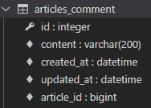
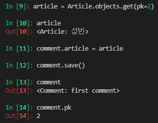
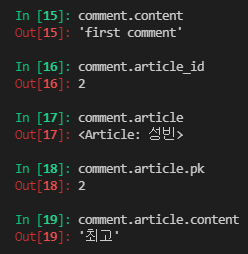
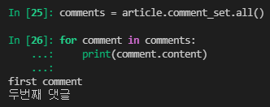
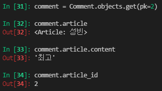
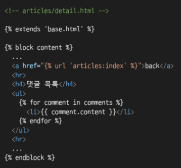
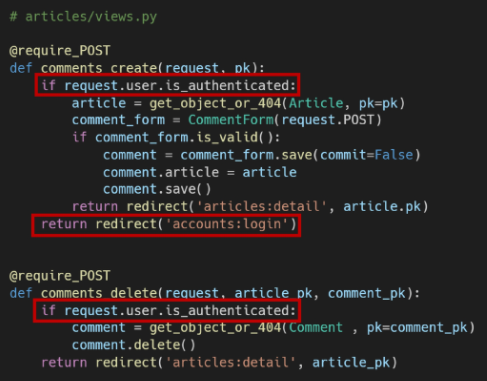
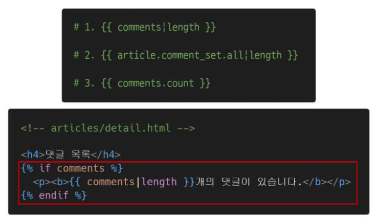

# django model relationship 1

* Foreign Key
  * Comment CREATE
  * Comment READ
  * Comment DELETE
* Customizing authentication in Django
  * Substituting a custom User model
  * Custom user & Built-in auth forms

---

### Foreign Key

* 키를 사용하여 부모 테이블의 유일한 값을 참조 (참조 무결성)

### ForeignKey field 1

* A many-to-one relationship
* 2개의 위치 인자가 반드시 필요
  1. 참조하는 model class
  2. on_delete 옵션
* migrate 작업 시 필드 이름에 _id를 추가하여 데이터베이스 열 이름을 만듦

> comment 모델 정의하기

```python
# articles/models.py

class Comment(models.Model):
    article = models.ForeignKey(Article, on_delete=models.CASCADE)
    content = models.CharField(max_length=200)
    created_at = models.DateTimeField(auto_now_add=True)
    updated_at = models.DateTimeField(auto_now=True)
    
    def __str__(self):
        return self.content
```

* ForeignKey arguments - `on_delete`
  * 외래 키가 참조하는 객체가 사라졌을 때 외래 키를 가진 객체를 어떻게 처리할 지를 정의
  * CASCADE : 부모 객체(참조 된 객체)가 삭제 됐을 때 이를 참조하는 객체도 삭제

> Migration 

1.  migrations 생성

```python
$ python manage.py makemigrations
```

2. migration 파일 확인
3. migrate

```python
$ python manage.py migrate
```

4. articles_comment 테이블의 외래 키 컬럼 확인 (필드 이름에 **_id**가 추가됨)



> 댓글 생성 연습하기 

```python
$ python manage.py shell_plus
```

* 댓글 생성 시도


* 에러 확인
  * articles_comment 테이블의 ForeignKeyField, article_id 값이 누락되었기 때문


* 게시글 생성 후 댓글 생성 재시도




* 댓글 속성 값 확인
  * 실제로 작성된 외래 키 컬럼명은 article_id 이기 때문에 article_pk 로는 값에 접근할 수 없음
  * comment 인스턴스를 통한 article 값 접근



* admin site 에서 작성된 댓글 확인

```python
# articles/admin.py

from .models import Article, Comment

admin.site.register(Comment)
```

```python
$ python manage.py createsuperuser
```

#### 1:N 관계 related manager

* 역참조('comment_set')
  * **Article(1) -> Comment(N)**
  * article.comment 형태로는 사용할 수 없고, article**.comment_set** manager가 생성됨
  * 게시글에 몇 개의 댓글이 작성 되었는지 Django ORM이 보장할 수 없기 때문
    * article은 comment가 있을 수도 있고, 없을 수도 있음
    * **실제로 Aricle 클래스에는 Comment 와의 어떠한 관계도 작성되어 있지 않음**
* 참조('article')
  * **Comment(N) -> Aricle(1)**
  * 댓글의 경우 어떠한 댓글이든 반드시 자신이 참조하고 있는 게시글이 있으므로, comment.article과 같이 접근할 수 있음
  * 실제 ForeignKeyField 또한 Comment 클래스에서 작성됨

> 1:N related manager 연습하기

* article의 입장에서 모든 댓글 조회하기 (역참조, 1 -> N)


* 조회한 모든 댓글 출력하기



* comment의 입장에서 참조하는 게시글 조회하기 (참조, N -> 1)



#### ForeignKey arguments - 'related_name'

* 역참조 시 사용할 이름('model_set' manager)을 변경할 수 있는 옵션

```python
# articles/models.py

class Comment(models.Model):
    article = models.ForeignKey(Article, on_delete=models.CASCADE, related_name='comments')
```

* 위와 같이 변경 하면 article.comment_set은 더이상 사용할 수 없고, **article.comments**로 대체됨
* [주의] 역참조 시 사용할 이름 수정 후, migration 과정 필요

### Comment CREATE

> CommentForm 작성

```python
# articles/forms.py

from .models import Article, Comment

class CommentForm(forms.ModelForm):
    
    class Meta:
        model = Comment
        fields = '__all__'
```

> detail 페이지에서 CommentForm 출력

```python
# articles/views.py

from .forms import ArticleForm, CommentForm

def detail(request, pk):
    article = get_object_or_404(Article, pk=pk)
    comment_form = CommentForm()
    context = {
        'article': article,
        'comment_form': comment_form,
    }
    return render(request, 'articles/detail.html'. context)
```

```html
<!-- articles/detail.html -->




	...
	<a href="">[back]</a>
  	<hr>
    <form action="" method="POST">
      
      {{ comment_form }}
      <input type="submit">
    </form>

```

* ForeignKeyField를 작성자가 직접 입력하는 상황이 발생


* CommentForm에서 외래 키 필드 출력 제외

```python
# articles/forms.py

class CommentForm(forms.ModelForm):
    
    class Meta:
        model = Comment
        exclude = ('article',)
```

> 댓글 작성 로직

```python
# articles/urls.py

app_name = 'articles'
urlpatterns = [
    path('<int:pk>/comments/', views.comments_create, name='comments_create'),
]
```

```html
<!-- articles/detail.html -->

<form action="" method="POST">
    
    {{ comment_form }}
    <input type="submit">
</form> 
```

```python
# articles/views.py

@require_POST
def comments_create(request, pk):
    article = get_object_or_404(Article, pk=pk)
    comment_form = CommentForm(request.POST)
    if comment_form.is_vaild():
        comment = comment_form.save(commit=False)
        comment.article = article
        comment.save()
    return redirect('articles:detail', article.pk)
```

#### 'save()' method

* save(commit=False)
  * 아직 **데이터베이스에 저장되지 않은 인스턴스를 반환**
  * 저장하기 전에 **객체에 대한 사용자 지정 처리를 수행할 때** 유용하게 사용

### Comment READ

> 댓글 출력

* 특정 article에 있는 모든 댓글을 가져온 후 context에 추가

```python
# articles/views.py

from .models import Article, Comment

def detail(request, pk):
    article = get_object_or_404(Article, pk=pk)
    comment_form = CommentForm()
    comments = article.comment_set.all()
    context = {
        'article': article,
        'comment_form': comment_form,
        'comments': comments,
    }
    return render(request, 'articles/detail.html', context)
```



### Comment DELETE

```python
# articles/urls.py

app_name = 'articles'
urlpatterns = [
    path('<int:article_pk>/comments/<int:comment_pk>/delete/', views.comments_delete, name='comments_delete'),
]
```

```python
# articles/views.py

@require_POST
def comments_delete(request, article_pk, comment_pk):
    comment = get_object_or_404(Comment, pk=comment_pk)
    comment.delete()
    return redirect('articles:detail', article_pk)
```


#### 인증된 사용자의 경우만 댓글 작성 및 삭제



### Comment 추가사항

#### 댓글 개수 출력하기



#### 댓글이 없는 경우 대체 컨텐츠 출력 (DTL의 for-empty 태그 활용)


### User 모델 대체하기

* 일부 프로젝트에서는 Django의 **내장 User 모델이 제공하는 인증 요구사항이 적절하지 않을 수 있음**
  * ex) username 대신 email을 식별 토큰으로 사용하는 것이 더 적합한 사이트
* Django는 User를 참조하는데 사용하는 **AUTH_USER_MODEL** 값을 제공하여, default user model을 **재정의(override)** 할 수 있도록 함
* Django는 새 프로젝트를 시작하는 경우 기본 사용자 모델이 충분하더라도, **커스텀 유저 모델을 설정하는 것을 강력하게 권장**
  * **단, 프로젝트의 모든 migrations 혹은 첫 migrate를 실행하기 전에 이 작업을 마쳐야 함**

> Custom User 모델 정의하기 1

* 관리자 권한과 함께 완전한 기능을 갖춘 User 모델을 구현하는 기본 클래스인 AbstractUser를 상속받아 새로운 User 모델 작성

```python
# accounts/models.py

from django.contrib.auth.models import AbstractUser

class User(AbstractUser):
    pass
```

> Custom User 모델 정의하기 2

* 기존에 django가 사용하는 User 모델이었던 auth 앱의 User 모델을 accounts 앱의 User 모델을 사용하도록 변경

```python
# settings.py

AUTH_USER_MODEL = 'accounts.User'
```

> Custom User 모델 정의하기 3

* admin site에 Custom User 모델 등록

```python
# accounts/admin.py

from django.contrib import admin
from django.contrib.auth.admin import UserAdmin
from .models import User

admin.site.register(User, UserAdmin)
```

> Custom User 모델 정의하기 4

* **프로젝트 중간에 진행**했기 때문에 데이터베이스를 초기화 한 후 마이그레이션 진행
* 초기화 방법
  1. db.sqlite3 파일 삭제
  2. migrations 파일 모두 삭제

```python
$ python manage.py makemigrations
$ python manage.py migrate
```

### Custom user & Built-in auth forms

** sign up 이 안되는 문제 발생 **

* 기존 User 모델을 사용하기 때문에 커스텀 User 모델로 다시 작성하거나 확장해야 하는 forms
  * UserCreationForm
  * UserChangeForm

* 커스텀 User 모델이 AbstractUser의 하위 클래스인 경우 다음과 같은 방식으로 form을 확장

```python
from django.contrib.auth.forms import UserCreationForm
from myapp.models import CustomUser

class CustomUserCreationForm(UserCreationForm):
    
    class Meta(UserCreationForm.Meta):
        model = CustomUser
        fields = UserCreationForm.Meta.fields + ('custom_field',)
```

```python
# accounts/forms.py

from django.contrib.auth.forms import UserChangeForm, UserCreationForm

class CustomUserCreationForm(UserCreationForm):
    
    class Meta(UserCreationForm.Meta):
        model = get_user_model()
        fiedls = UserCreationForm.Meta.fields + ('email',)
```

```python
# accounts/views.py

from .forms import CustomUserChangeForm, CustomUserCreationForm

def signup(request):
    if request.user.is_authenticated:
        return redirect('articles:index')
    
    if request.method == 'POST':
        form = CustomUserCreationForm(request.POST)
        if form.is_valid():
            user = form.save()
            auth_login(request, user)
            return redirect('articles:index')
    else:
        form = CustomUserCreationForm()
    context = {
        'form': form,
    }
    return render(request, 'accounts/signup.html', context)
```

