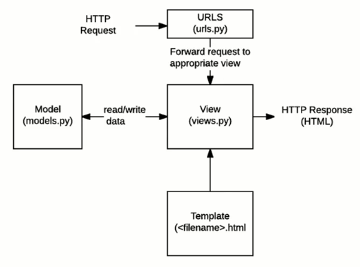

## 프레임워크 기반 웹 페이지 구현



### Django 시작하기

---------

**모든 프로젝트의 기본**

#### 1. 가상환경 설정

1)가상환경 만들기

pjt04(작업할 폴더)를 만들고 그 폴더 안에서 명령어를 친다.

`python -m venv venv(가상환경이름)`

`pjt04` 폴더 안에 `venv`이름의 하위폴더가 생성된다. 작업은 pjt04폴더 내에서 한다.

2)가상환경 활성화하기

pjt04폴더 안에서 `source venv/Scripts/activate`를 친다.

cmd 라인 바로 아래에 (venv)가 생기는데 활성화 되었다는 뜻이다.

3)가상환경 내에서 패키지 설치

* 설치된 패키지 목록 확인하기 : `pip list`

* 장고 패키지 설치 : `pip install django django_extensions`
  * settings.py 에 등록
* 패키지 목록 관리 : `pip freeze > requirements.txt`
  * 다른 가상환경에서 이 패키지들을 설치하려면 : `pip install -r requirements.txt`

#### 2.

1)README파일과 gitignore파일 생성 ( git이 관리하지 않을 내용들 )

`touch README.md .gitignore`

windows, python, venv, django ... 

#### 3. git 버전관리

`git init` -> `git add .` -> `git commit -m 'first commit'` -> `git remote add origin ''`

---------

#### 4. django 진짜 시작

1. project 생성 

   ```python
   $ django-admin startproject pjt04 .
   ```

   if project를 잘못생성했다면?

   ```python
   $ rm -rf pjt04/ manage.py
   ```

2.  서버 확인

   ```python
   $ python manage.py runserver
   ```

3.  언어, 시간 설정

   settings.py 에서 `LANGUAGE_CODE = 'ko-kr'` , `TIME_ZONE = 'Asia/Seoul'` 로 변경

4. application 생성

   ```django
   python manage.py startapp movies
   ```

   * app 생성 했으면 setting.py에 등록해줘야함

     settings.py 에서 `INSTALLED_APPS`에 `'movies',` 추가

5.  urls.py 작성하기

    import include, path('movies/', include('movie.urls')),

6.  필요한 폴더, 파일 생성하기

    `movies/urls.py` `movies/forms.py` `movies/templates/movies` + 각 종 html...

7.  movies/urls.py 작성하기

    ```python
    from django.urls import path
    from . import views
    
    app_name =
    urlpatterns = [
        
    ]
    ```

8. **중요** movies/models.py 작성하기

   모델이란 부가적인 메타데이터를 가진 데이터베이스의 구조(layout) 이다.

   movies에 models.py 파일을 생성한다.

   ```python
   $ python manage.py makemigrations
   $ python manage.py migrate
   ```

9.   admin 만들기

    ```python
    # movies/admin.py
    
    from django.contrib import admin
    from .models import Movie
    
    admin.site.register(Movie)
    ```

    ```python
    $ python manage.py createsuperuser
    ```

10.   urls.py 만지기

     `pjt04/urls.py`

     ```python
     # movies/urls.py
     
     from django.urls import path
     from . import views
     
     app_name = 'accounts'
     urlpatterns = [
     
     ]
     ```

11. view 작성하기

   movies/views.py 작성한다. 

   ```python
   from django.shortcuts import render, redirect, get_object_or_404
   from django.views.decorators.http import require_safe, require_POST, require_http_method
   from .models import Movie
   from .forms import MovieForm
   
   def create(request):
       pass
   
   def index(request):
       movies = Movie.objects.order_by('-pk') # 목록을 쭈르륵 보여주는 것
       context = {
           'movies': movies,
       }
       return render(request, 'movies/index.html', context)
   
   def detail(request, pk):
       movie = Movie.objects.get(pk=pk) # 목록 하나만 보여주는 것
       ...
   ```


templates/base.html 만들기

settings.py 에서 TEMPLATES=[ {'DIRS': [BASE_DIR / 'templates'], ..}] 추가하기


장고는 http method를 GET, POST 밖에 이해하지 못한다.

대문자로 쓰는 이유 = 재할당 하지말라는 뜻

```python
$ pip install django-bootstrap-v5
```

settings.py `INSTALLED_APPS`에 `bootstrap5` 추가 // cdn 코드를 직접 들고오는게 더 좋음

`` ``

templates/ 안에 `_navbar.html` 넣어서  으로 나누면 유지보수 쉬워짐

django paginator

